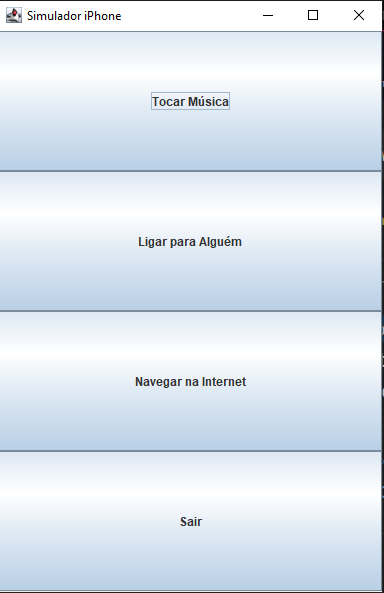
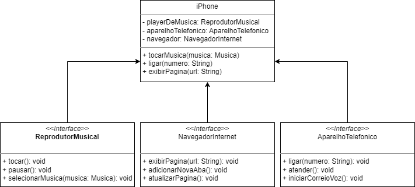

# Desafio_iPhone
Desafio de criar uma um projeto iPhone usando os conceitos de POO e modelagem UML

## Capturas de Tela

*Descrição: Esta é a tela inicial do aplicativo "Desafio iPhone".*

*Descrição: Este é o diagrama UML do projeto "Desafio iPhone".*
